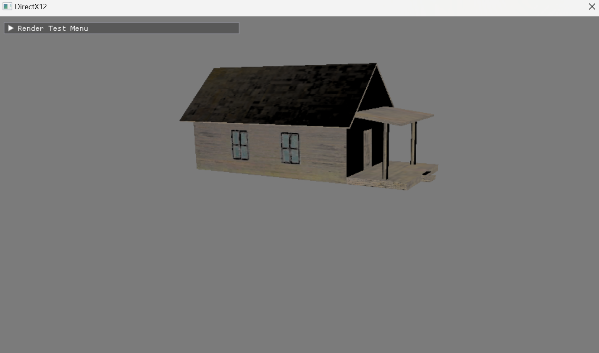
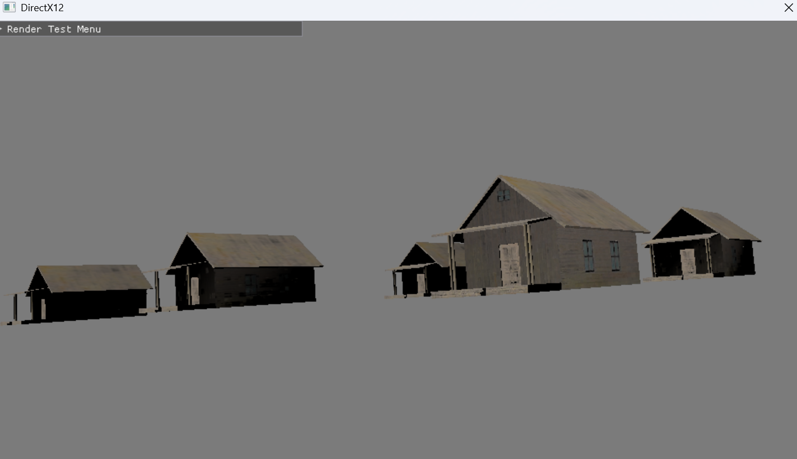
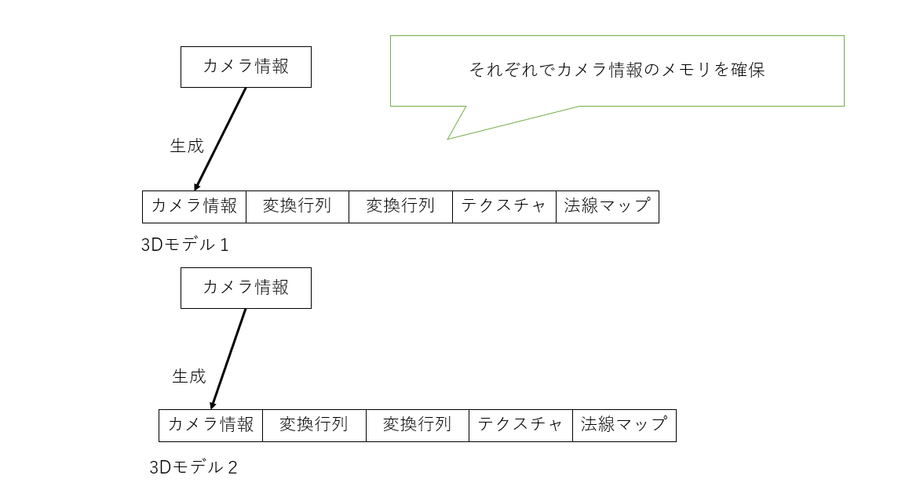
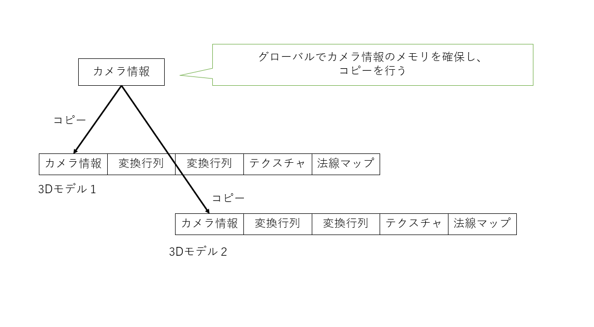
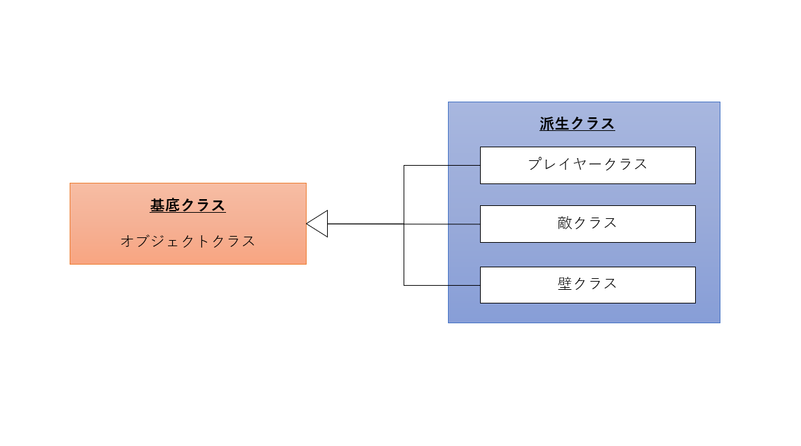
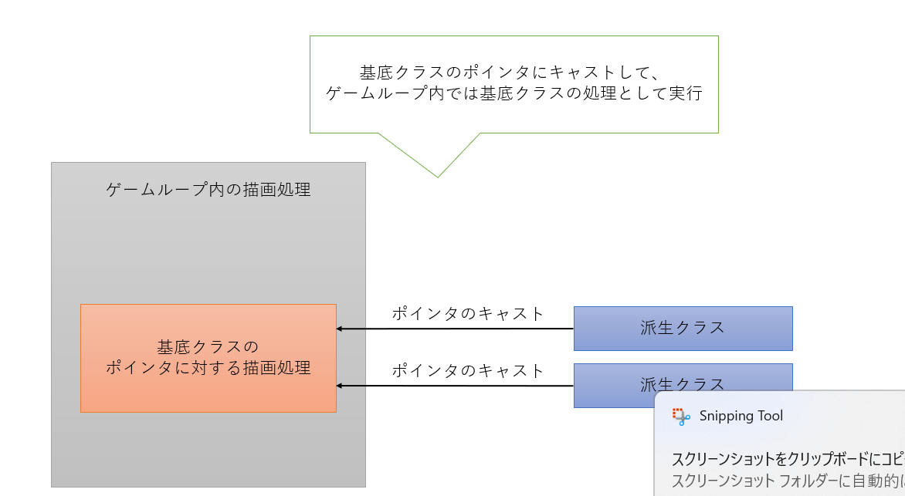

## 制作した内容
グラフィックスAPIであるDirectX12とC++を用いて、3Dメッシュモデルの表示を行うライブラリです。
1つの3Dモデルにテクスチャ・法線マップの2つまでリソースが反映できます。

- 頂点バッファ・インデックスバッファの生成処理
- 描画用パイプライン処理
- 入力デバイスの処理
- カメラの制御

## 使用したライブラリ
- DirectXTK\
  テクスチャを読み込み、そのメモリのバッファを生成するライブラリ。
- Assimp\
  3Dモデルの頂点情報などを読み込むためのライブラリ。
- ImGui\
  UI表示を行うことができるライブラリ。

## 工夫した点
カメラの情報は複数のモデルが存在しても同じ情報を参照するので、
カメラ用のメモリを無駄に消費しないように、初めに生成したメモリのアドレスのコピーを行う処理を作成した。

テクスチャなどのリソースは固定バッファ方式を採用しており、
アクセスする際には一定のオフセットでアクセスできるようになっています。
そのため、リソースの管理をしやすくするためにDescriptorManagerクラスを作成し、
そのクラスでリソース割り当ての処理を一括で行いました。

オブジェクトクラスを基底クラスとして定義したことで、今回作成したライブラリを用いてゲーム開発を行う際に、
プレイヤクラスや敵クラスを派生クラスとして定義することができ、新たらしくリソース生成処理などを記述しなくてよくなった。
また、描画ループ内は基底クラスのポインタで処理を記述しているので、派生クラスを基底クラスにポインタキャストを行うことで派生クラスの描画ができる。
さらに、派生クラスを基底クラスで一括管理ができるので、ゲーム開発に使う当たり判定をfor文で順に処理するのみとなり、記述が簡単にできるといったメリットがある。

## 改善点
カメラの平行移動や回転移動が意図した動きにならない場面があるため、移動処理を改善したい。

テクスチャが固定オフセット方式であるため、必ず1つのモデルにつきテクスチャ用のメモリが固定で割り当てられる。
今回の場合、1つのモデルに2つのテクスチャを固定で割り当てる設定を行っているので、
テクスチャが1つしか必要ない場合のモデルに関しても余分にメモリを割り当ててしまったり、
テクスチャを多数所持する3Dモデルに対しては固定の数のみしか反映されないことが起きる。
動的にテクスチャのメモリを割り当てられるように改善したい。

## 参考書籍
- 「Direct3Dゲームグラフィックス実践ガイド」
- 「DirectX12の魔導書　3Dレンダリングの基礎からMMDモデルを躍らせるまで」
- 「ゲーム制作者になるための3Dグラフィックス技術」
